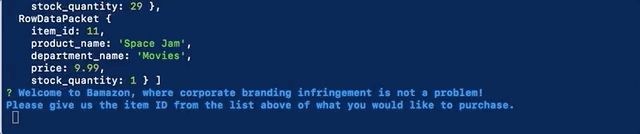
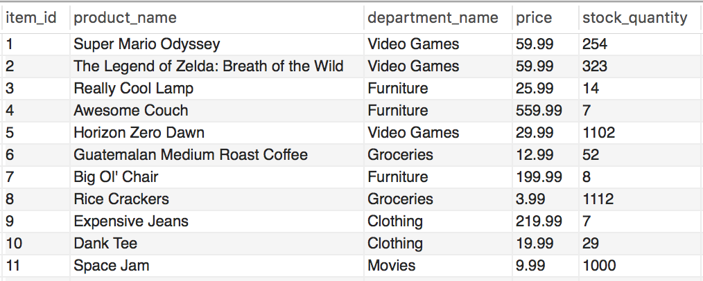
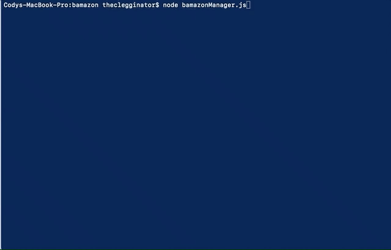
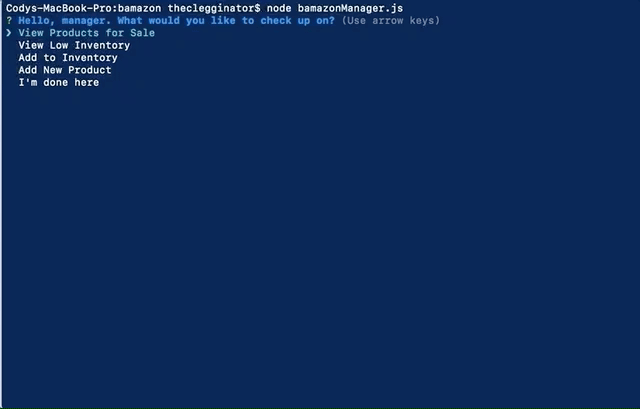

# Bamazon - Node.js/MySQL Warehouse
## Summary
Bamazon is a Node.js application that is run through the command prompt. There are two separate Javascript files--the first, bamazonCustomer.js, allows a "customer" user to to see items and inventory and make a "purchase". The mock inventory for Bamazon is maintained in a MySQL database, and is updated live depending on user interaction. The second Javascript file, bamazonManager.js, has more advanced feature and allows maintanence of the inventory in the database. 

### Module Dependencies
The following Node modules are used (and are included in the package.json file):
* inquirer - used for user interaction. Provides prompts and walks the user through required information for their commands.
* dotenv - used for storing environmental variables for the users computer to run the app (database credentials in this instance).
* mysql - used for providing SQL queries through Node.js on the bamazon database.

### Bamazon Customer: View Inventory and Purchase an Item
* When running bamazonCustomer.js, the current inventory of the Bamazon database will be display.
* The user will be prompted with which item ID from the database they would like to purchase.
* Every time a customer tries to buy an item, the inventory will be checked in the database.
* As can be seen below, Bamazon had sufficient inventory of the item requested, so it showed the user how much their order would cost and reduced the stock in the database.
  

* Since the application checks the inventory each time a request is made, as can be seen below, if there is insufficient inventory to fulfill the customer's request, Bamazon will not allow the order to got through.

* The database schema for Bamazon can be seen below:

### Bamazon Manager Function 1: *View Products for Sale*
* When running bamazonManager.js, a list of a few options will show on the console.
* This feature will query the database and show the manager what is currently in stock.
  

### Bamazon Manager Function 2: *View Low Inventory*
* This feature will query the database and show the manager any items that have a stock of less than 5 units available.
* If everything is properly stocked, the manager will be notified of that as well.

### Bamazon Manager Function 3: *Add to Inventory*
* This feature will query allow the manager to increase the inventory of an item already in stock.
* It will then report the new stock and ensure the database is updated.

